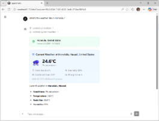
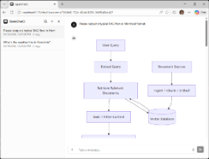
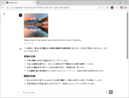
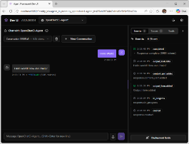
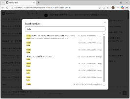
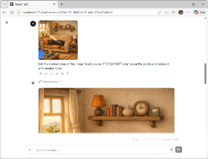
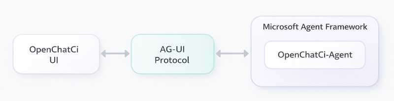

# ChatWalaʻau

**The localhost AI Agent Runtime** -- Chat UI, Tools, RAG, and MCP in one `pip install`

[](https://pypi.org/project/chatwalaau/)
[](LICENSE.md)
[](https://pypi.org/project/chatwalaau/)

ChatWalaʻau is a **full-stack AI agent runtime** that runs entirely on localhost. It connects a modern chat UI to AI agents via the AG-UI protocol, with built-in tools, RAG pipeline, MCP integration, and an OpenAI-compatible API -- all from a single `pip install`.

## About the Name

"Walaʻau" (wah-la-OW) is a Hawaiian word meaning "to chat, talk, or
converse." We chose it because it captures what the agent does, in the
language of the place where the project is built.

Hawaiian (ʻōlelo Hawaiʻi) is an indigenous language of the Hawaiian
Islands. After a long period of suppression, it is now in active
revitalization. We use this word with respect and gratitude.

### Why ChatWalaʻau?

- **One command, full stack** -- `pip install chatwalaau` gives you Chat UI + Agent Runtime + Tools + RAG. No Docker, no cloud setup.
- **MCP native** -- Claude Desktop-compatible config. Connect any MCP server. MCP Apps render interactive UI in chat.
- **Your data stays local** -- File-based sessions, ChromaDB vectors, and uploads never leave your machine.
- **OpenAI-compatible API** -- Expose your agent as `/v1/responses` for any app using the OpenAI SDK.

> Hawaii-built, powered by [Microsoft Agent Framework](https://github.com/microsoft/agent-framework)

---

## UI Preview

<p align="center">



</p>
<p align="center">
<sub>Weather Tools | Mermaid Diagrams | Image Analysis</sub>
</p>
<p align="center">



</p>
<p align="center">
<sub>DevUI | Search Session | Image Generation</sub>
</p>

---

## Quick Start

```bash
pip install chatwalaau
chatwalaau init
# Edit .env and set AZURE_OPENAI_ENDPOINT
az login
chatwalaau
```

Open: [http://localhost:8000/chat](http://localhost:8000/chat)

> **On a corporate network (TLS-intercepting proxy / in-house root CA)?**
> Install with the `corp` extras so Python honours your OS certificate
> store instead of the bundled `certifi`:
>
> ```bash
> pip install "chatwalaau[corp]"
> ```
>
> Adds `pip-system-certs`. Default installs are unaffected.

---

## Features

### Chat & UI

- Chat with AI agents via AG-UI protocol (SSE streaming)
- Rich message rendering: Markdown, code blocks, math (KaTeX), Mermaid diagrams
- LLM reasoning visualization with collapsible thinking blocks
- Web search with inline citation links
- Voice input via microphone with Whisper transcription
- Text-to-Speech playback and download via ElevenLabs
- Multimodal image analysis (file attachment, drag-and-drop, URL)
- Session management: save, search, pin, archive, fork, rename
- Context window consumption display with warning levels
- Per-turn token usage display
- Three layout scenarios: Chat, Popup, Sidebar
- Multilingual chat with browser auto-translation suppressed

### Agent Tools

- Image generation, editing, and Canvas mask editor via Azure OpenAI gpt-image-1.5
- Weather tools with rich card widgets (Open-Meteo, no API key)
- Coding tools (file read/write, shell execution, file search)
- Prompt Templates: save, manage, and insert reusable prompts from "+" menu and message actions
- Agent Skills: portable domain knowledge packages with progressive disclosure

### Platform

- MCP Integration: connect external tools via Model Context Protocol (Claude Desktop-compatible config)
- MCP Apps: interactive UI rendered in sandboxed iframes for MCP tools with `_meta.ui` resources
- RAG Pipeline: PDF ingestion with ChromaDB vector search, Azure OpenAI embedding, and source citations
- Batch Processing: async job queue via Core MCP Server with real-time MCP Apps dashboard
- Multi-model switching: switch between OpenAI models mid-conversation with per-model reasoning and context window
- Session management: save, search, organize into folders, pin, archive, fork, rename
- Background Responses: long-running agent timeout prevention with stream resumption
- Context window consumption display with warning levels
- Per-turn token usage display
- OpenAI-compatible API: expose agent as `/v1/responses` endpoint for external apps via OpenAI SDK
- Unified API authentication: single `API_KEY` Bearer token protects `/v1/responses`, every write REST endpoint, and the AG-UI chat stream for non-loopback (LAN) callers; same-machine clients always bypass
- Web SPA authentication (optional): single-user ID/PW login with HttpOnly opaque session cookie for cloud-deployed instances; coexists with `API_KEY`
- CLI Client: chat, session/template/model management, TTS, and upload from the command line with local preflight validation for filename, MIME type, and size
- HTTPS/TLS support for LAN access with Secure Context (mkcert recommended)
- Multilingual chat with browser auto-translation suppressed
- Three layout scenarios: Chat, Popup, Sidebar

---

## Architecture

The platform connects the UI and agent runtime through the AG-UI protocol.

<p align="center">

</p>

---

## Development Setup

### Prerequisites

| Tool      | Version | Install                                                                                                            |
| --------- | ------- | ------------------------------------------------------------------------------------------------------------------ |
| Node.js   | 22+     | [https://nodejs.org/](https://nodejs.org/)                                                                         |
| pnpm      | 10+     | `npm install -g pnpm`                                                                                              |
| Python    | 3.12+   | [https://www.python.org/](https://www.python.org/)                                                                 |
| uv        | 0.9+    | [https://docs.astral.sh/uv/](https://docs.astral.sh/uv/)                                                           |
| Azure CLI | 2.x     | [https://learn.microsoft.com/cli/azure/install-azure-cli](https://learn.microsoft.com/cli/azure/install-azure-cli) |

---

### 1. Azure Authentication

The backend authenticates to Azure OpenAI via `AzureCliCredential`.
You must log in before starting.

```bash
az login
```

Select the subscription if needed:

```bash
az account set --subscription <subscription-id>
```

---

### 2. Backend Setup

**Windows (PowerShell):**

```powershell
cd backend
copy .env.sample .env
# Edit .env and set your Azure OpenAI endpoint
notepad .env
uv sync --prerelease=allow
```

**macOS / Linux:**

```bash
cd backend
cp .env.sample .env
# Edit .env and set your Azure OpenAI endpoint
nano .env
uv sync --prerelease=allow
```

`.env` configuration (required):

```
AZURE_OPENAI_ENDPOINT=https://<your-resource>.openai.azure.com/
AZURE_OPENAI_MODELS=gpt-4o
```

---

### 3. Frontend Setup

```bash
cd frontend
pnpm install
```

---

### 4. Start Development Servers

Open two terminals:

**Terminal 1 -- Backend:**

```bash
cd backend
uv run uvicorn app.main:app --reload --app-dir src
```

Backend starts at [http://localhost:8000](http://localhost:8000)

**Terminal 2 -- Frontend:**

```bash
cd frontend
pnpm dev
```

Frontend dev server starts at [http://localhost:5173](http://localhost:5173)
(API requests are proxied to the backend)

---

### 5. Production Build

```bash
cd frontend
pnpm build

cd ../backend
uv run uvicorn app.main:app --app-dir src
```

The backend serves both frontend build artifacts and the API at [http://localhost:8000](http://localhost:8000)

---

## CLI Usage

### Server Commands

```
chatwalaau                                Start the server
chatwalaau init                           Generate .env from template
chatwalaau init --force                   Overwrite existing .env
chatwalaau hash-password                  Generate AUTH_PASSWORD_HASH (interactive)
chatwalaau hash-password --stdin --quiet  Generate hash from stdin (scripted)
chatwalaau --host 0.0.0.0                 Bind to all interfaces
chatwalaau --port 9000                    Use custom port
chatwalaau --skip-auth-check              Skip Azure CLI login check
chatwalaau --ssl-certfile cert.pem \
           --ssl-keyfile key.pem          Enable HTTPS (LAN access)
chatwalaau --version                      Show version
```

### Client Commands

Interact with a running ChatWalaʻau instance from the command line. All client commands support `--json` for machine-readable output and `--base-url` / `--api-key` for remote server access.

```bash
# Chat with the agent (single-shot)
chatwalaau chat "What is the weather in Tokyo?"

# Interactive chat (REPL mode)
chatwalaau chat -i

# Chat with specific model and session
chatwalaau chat "hello" -m gpt-4o -s <session-id>

# Session management
chatwalaau sessions list
chatwalaau sessions get <id> --messages
chatwalaau sessions delete <id>
chatwalaau sessions export <id> -o backup.json

# Template management
chatwalaau templates list
chatwalaau templates create -n "Bug Report" -c "Describe the bug..."

# Model info
chatwalaau models list

# Text-to-Speech
chatwalaau tts "Hello world" -o greeting.mp3

# File upload
chatwalaau upload document.pdf -s <session-id>

# JSON output for scripting / agent-to-agent
chatwalaau sessions list --json | jq '.[].thread_id'

# Remote server with HTTPS (self-signed cert)
chatwalaau sessions list --base-url https://192.168.1.10:8000 --no-verify
```

`chatwalaau upload` validates the local file before sending the request: the file must exist, the sanitized filename must remain valid, the MIME type must be one of the supported image formats or PDF, and the size limit must stay within 20MB for images or 50MB for PDFs.

Environment variables for client configuration:

```
CHATWALAAU_URL=http://localhost:8000       # Default server URL
CHATWALAAU_API_KEY=sk-your-key             # Bearer token (reuses API_KEY if not set)
```

---

## Tech Stack

| Layer    | Technology                   | Purpose                        |
| -------- | ---------------------------- | ------------------------------ |
| Frontend | React 19 + TypeScript + Vite | UI framework                   |
| Frontend | Tailwind CSS + shadcn/ui     | Styling + Components           |
| Frontend | Biome                        | Format + Lint                  |
| Backend  | FastAPI + Python 3.12+       | API server                     |
| Backend  | Microsoft Agent Framework    | Agent execution + Tool control |
| Backend  | Ruff                         | Format + Lint                  |
| Package  | uv                           | Python dependency management   |
| Package  | pnpm                         | Node.js dependency management  |

---

## Optional Features

### Prompt Templates

Save and reuse prompt templates from the chat interface:

```
TEMPLATES_DIR=.templates
```

- Click **+** button > **Use template** to open the management modal
- Create, edit, delete templates with name, category, and body
- **Insert to Chat** pastes the template into the input (editable before send)
- Click the **FileText** icon on any user message to save it as a template

Templates are stored as individual JSON files in the configured directory.

---

### Image Generation

Generate and edit images via Azure OpenAI gpt-image-1.5:

```
IMAGE_DEPLOYMENT_NAME=gpt-image-1.5
```

- **generate_image**: create images from text prompts with configurable size, quality, format, background, and count (1-4)
- **edit_image**: modify existing session images using text prompts (prompt-based)
- **Canvas Mask Editor**: click the **Edit** button on any generated image to open a full-screen mask editor
  - Draw over areas to edit with brush tools (S/M/L), eraser, undo/redo
  - Enter a prompt and click Generate -- the agent edits only the masked region
- Generated images displayed inline in chat with click-to-open full-size
- Images stored in session upload directory and persist across reloads

The agent automatically uses these tools when users request image creation or editing. No opt-in flag needed -- the feature activates when `IMAGE_DEPLOYMENT_NAME` is set.

---

### Coding Tools

Enable AI-powered file operations and shell execution:

```
CODING_ENABLED=true
CODING_WORKSPACE_DIR=C:\path\to\workspace
# Optional: bound file_read output to protect memory + context window
# CODING_FILE_READ_MAX_BYTES=1048576   # 1 MiB default
```

`file_read` now stats the target before reading and caps the output at
`CODING_FILE_READ_MAX_BYTES` (default 1 MiB). When the cap or the line
limit is hit, the response ends with an explicit
`[TRUNCATED BY BYTES: ...]` / `[TRUNCATED BY LIMIT: ...]` marker that
tells the agent how to paginate with `offset=N`.

---

### Text-to-Speech

Enable on-demand TTS for messages via [ElevenLabs](https://elevenlabs.io/):

```
ELEVENLABS_API_KEY=your-api-key
TTS_MODEL_ID=eleven_multilingual_v2
TTS_VOICE_ID=your-voice-id
```

Speaker button plays audio, download button saves MP3 file. Audio is cached to avoid duplicate API calls.

---

### Agent Skills

Extend the agent with domain knowledge packages ([Agent Skills specification](https://agentskills.io/)):

```
SKILLS_DIR=.skills
```

Place `SKILL.md` files in subdirectories. The agent discovers and loads skills on demand:

```
.skills/
  my-skill/
  +-- SKILL.md          # Required: instructions + metadata
  +-- scripts/          # Optional: executable code
  +-- references/       # Optional: documentation
  +-- assets/           # Optional: templates, resources
```

Skills use progressive disclosure to minimize context window consumption (~100 tokens per skill when idle).

---

### MCP Integration

Connect external tools and services via [Model Context Protocol](https://modelcontextprotocol.io/) using the Claude Desktop-compatible configuration format:

```
MCP_CONFIG_FILE=mcp_servers.json
```

Create a `mcp_servers.json` file (see `backend/mcp_servers.sample.json`):

```json
{
  "mcpServers": {
    "filesystem": {
      "command": "npx",
      "args": ["-y", "@modelcontextprotocol/server-filesystem", "/path/to/workspace"]
    },
    "remote-api": {
      "url": "https://api.example.com/mcp",
      "headers": { "Authorization": "Bearer token" }
    }
  }
}
```

- **stdio** servers (with `command`): ChatWalaʻau spawns the process and communicates via stdin/stdout
- **HTTP/SSE** servers (with `url`): ChatWalaʻau connects to a running remote server
- MCP tools appear alongside built-in tools (Weather, Coding, Image Generation)
- Tool calls display with categorized icons: built-in tools have dedicated icons, Skills tools show **BookOpen**/**FileText**, MCP tools show **Plug**
- Server lifecycle managed automatically (startup/shutdown with zombie process prevention)
- **Optional per-server fields** (Claude Desktop-compatible, ignored elsewhere):
  - `"load_prompts": true` -- set when your MCP server implements `prompts/list` (most community servers are tools-only; the default is `false` so filesystem, git, github, etc. connect cleanly out of the box)
  - `"load_tools": false` -- skip the `tools/list` probe for a tools-only server's prompts-only mode
  - `"request_timeout": 30` -- per-call timeout in seconds forwarded to MAF
- Reuse your existing Claude Desktop / Claude Code / Cursor MCP configurations

---

### MCP Apps

MCP tools that declare a `_meta.ui` resource automatically render interactive UI within chat messages. The HTML View runs in a secure double-iframe sandbox with CSP enforcement.

```
# Optional: change the sandbox proxy port (default 8081)
# MCP_APPS_SANDBOX_PORT=8081
```

- **Automatic discovery**: UI-enabled MCP tools detected at server startup
- **Double-iframe sandbox**: Views run on a separate origin with no access to host DOM, cookies, or storage
- **CSP enforcement**: external resources blocked by default; servers declare required domains via metadata
- **View-to-Server proxying**: all View interactions proxied through the Host (auditable)
- **Display modes**: inline (in chat) and fullscreen
- **Session persistence**: View HTML stored as files for reload restoration
- **Progressive enhancement**: tools work as text-only when UI is unavailable or unsupported

No configuration needed -- MCP Apps activates when MCP tools have `_meta.ui.resourceUri` in their definitions. The sandbox proxy starts automatically alongside MCP servers.

---

### RAG Pipeline

Upload PDF documents and ask questions about their content using vector similarity search:

```
CHROMA_DIR=.chroma
RAG_COLLECTION_NAME=default
RAG_TOP_K=5
EMBEDDING_DEPLOYMENT_NAME=text-embedding-3-small
RAG_CHUNK_SIZE=800
RAG_CHUNK_OVERLAP=200
# Optional: trailing-chunk merge threshold (unset -> RAG_CHUNK_SIZE // 4; 0 disables)
# RAG_CHUNK_MIN_SIZE=200
```

1. Click **+** button > **Attach PDF** to upload a document
2. Ask the agent: *"Please ingest this document"*
3. The batch job processes: PDF parsing > chunking > embedding > ChromaDB storage
4. Ask questions: *"What does the document say about X?"*
5. The agent searches the knowledge base and responds with source citations (filename, page)

- **ChromaDB PersistentClient**: file-based vector storage (`.chroma/` directory)
- **Azure OpenAI Embedding**: `text-embedding-3-small` for consistent multilingual quality
- **Singleton embedding client**: Azure CLI credential resolution and TLS handshake run once per batch server process, not once per 100-text batch
- **Overlap chunking**: configurable chunk size (800 chars) and overlap (200 chars) with tail-merge that drops or folds sub-minimum trailing fragments so tiny chunks do not pollute top-k retrieval
- **Metadata filtering**: source filename, page number, chunk index for precise citation
- **Deduplication**: re-ingesting the same file overwrites existing chunks automatically
- **PDF file cards**: PDFs display as file icon cards (not image thumbnails) in chat

Requires the Batch Processing MCP Server to be configured (see below).

---

### Batch Processing

Run long-running tasks (RAG ingestion, data pipelines) as background batch jobs with a real-time monitoring dashboard:

1. Add `"batch"` to your `mcp_servers.json` (see `backend/mcp_servers.sample.json`)
2. Start the server -- the batch MCP server launches automatically
3. Ask the agent: *"Submit a sleep job for 60 seconds"*
4. A real-time dashboard appears inline showing progress, status, and controls

```json
{
  "mcpServers": {
    "batch": {
      "command": "uv",
      "args": ["run", "python", "-m", "app.mcp_batch.server"],
      "env": {
        "BATCH_JOBS_DIR": ".jobs",
        "BATCH_ENABLE_SAMPLE_JOBS": "false"
      }
    }
  }
}
```

- **Conversation-based management**: submit, monitor, cancel, delete jobs via chat
- **MCP Apps dashboard**: auto-refreshing progress bars, cancel/delete with confirmation dialogs
- **File-based persistence**: each job stored as a JSON file (crash-resilient)
- **Core job types**: RAG Ingestion Pipeline (`rag-ingest`). The Phase-1 `sleep` sample job is hidden by default; set `BATCH_ENABLE_SAMPLE_JOBS=true` in the batch server env to enable it for demos or tests.
- **Cooperative cancellation**: jobs check cancel flag at each progress checkpoint

---

### Background Responses

For long-running agent operations (e.g., o3/o4-mini reasoning models), enable Background Responses to prevent timeouts:

1. Click the **BG** toggle button (left of the context window indicator)
2. ChatInput border turns blue when active
3. Continuation tokens are auto-saved to session for page reload resumption

No environment variable needed -- toggle on/off per session via the UI.

---

### API Authentication

`API_KEY` is the **unified Bearer token** that protects the external-app
OpenAI API, every write REST endpoint, and the AG-UI chat stream when
reached from a non-loopback (LAN) client. Same-machine clients
(`127.0.0.1`, `::1`, `localhost`) bypass auth so localhost development
stays zero-configuration even when `APP_HOST=0.0.0.0` for LAN exposure.

```
API_KEY=sk-chatwalaau-your-secret-key-here
# APP_REQUIRE_AUTH_ON_LAN=true   # default: fail-closed on LAN without a key
```

Decision matrix for write endpoints (image edit, upload, MCP Apps RPC,
sessions write, templates write, TTS, STT) **and the AG-UI chat stream
(`POST /ag-ui/`)**:

| Client address | `APP_REQUIRE_AUTH_ON_LAN` | `API_KEY` | Outcome |
|----------------|---------------------------|-----------|---------|
| loopback       | any                       | any       | allow   |
| LAN            | `false`                   | any       | allow (operator opt-out) |
| LAN            | `true`                    | empty     | 503     |
| LAN            | `true`                    | set       | Bearer required |

`/v1/responses` (OpenAI API below) always requires a matching Bearer key regardless of client address because it is designed for external apps.

**Upgrading from a release before v0.47.0** with `APP_HOST` non-loopback
and `API_KEY` unset: AG-UI now returns the same 503 / 401 as every other
write endpoint. Add `API_KEY=...` to `.env`, or accept LAN exposure
explicitly with `APP_REQUIRE_AUTH_ON_LAN=false`.

---

### Web SPA Authentication

For deploying ChatWalaʻau as a private cloud web app where a single
operator signs in through the browser. Coexists with `API_KEY` (which
remains for CLI / external SDK access) and is **disabled by default** --
operators who do not set `AUTH_USERNAME` see no behavior change.

```
AUTH_USERNAME=admin
AUTH_PASSWORD_HASH=scrypt$N=16384,r=8,p=1$<base64-salt>$<base64-hash>
# AUTH_SESSION_TTL_SECONDS=86400         # default 24h, sliding
# AUTH_COOKIE_SECURE=auto                # auto / true / false
# AUTH_COOKIE_NAME=chatwalaau_session
```

Generate `AUTH_PASSWORD_HASH` with the bundled CLI:

```bash
# Interactive (prompts twice for confirmation, hidden input)
chatwalaau hash-password

# From a secret manager / pipeline
echo "$PASSWORD" | chatwalaau hash-password --stdin --quiet
```

When `AUTH_USERNAME` is set, the SPA renders a `/login` page; the
server validates credentials in constant time, issues an opaque
token, and returns it via an `HttpOnly` + `SameSite=Strict` cookie.
The backend then accepts EITHER a Bearer `API_KEY` OR a valid
session cookie on every write endpoint and the AG-UI chat stream.
The `/v1/responses` external-app path stays Bearer-only.

Properties:

- No new Python dependency (uses stdlib `hashlib.scrypt` and
  `secrets`)
- Single-user model: one username + one password hash in `.env`
- Process-local session store: no on-disk persistence, restarts
  re-prompt the user
- HTTPS strongly recommended for non-loopback deployments
- Loopback CLI calls (`curl localhost`, `chatwalaau` subcommands)
  keep their no-credential bypass so the local development
  workflow is unaffected

---

### OpenAI Compatible API

Expose the agent as an OpenAI-compatible endpoint for external applications:

```
API_KEY=sk-chatwalaau-your-secret-key-here
```

Any app using the [OpenAI SDK](https://github.com/openai/openai-python) can consume the agent by pointing `base_url`:

```python
from openai import OpenAI

client = OpenAI(
    base_url="http://localhost:8000/v1",
    api_key="sk-chatwalaau-your-secret-key-here",
)

# Non-streaming
response = client.responses.create(
    model="chatwalaau",
    input="What is the weather in Tokyo?",
)

# Streaming
stream = client.responses.create(
    model="chatwalaau",
    input="Explain quantum computing.",
    stream=True,
)
for event in stream:
    if event.type == "response.output_text.delta":
        print(event.delta, end="", flush=True)
```

- All agent Tools (Weather, Coding, Image Generation) and Skills are available
- Multi-turn conversations via `previous_response_id`
- API sessions appear in the chat sidebar with an **API** badge
- Streaming (SSE) and non-streaming response modes
- For HTTPS/LAN access, see [OpenAI API Setup Guide](assets/docs/guides/openai-api-setup.md)

---

### HTTPS / LAN Access

Access ChatWalaʻau from other devices on your home network (phones, tablets, other PCs).
HTTPS enables browser Secure Context for voice input and clipboard on non-localhost origins.

```
APP_HOST=0.0.0.0
APP_SSL_CERTFILE=.certs/cert.pem
APP_SSL_KEYFILE=.certs/key.pem
```

Setup:

1. Install [mkcert](https://github.com/FiloSottile/mkcert) and run `mkcert -install`
2. Issue a certificate: `mkcert -cert-file .certs/cert.pem -key-file .certs/key.pem <your-ip> localhost 127.0.0.1`
3. Set the env vars above in `.env`
4. Allow ports through firewall (8000 for production, 5173 for dev mode)
5. Install the CA certificate (`rootCA.pem`) on each client device

Access from LAN: `https://<your-ip>:8000`

When SSL is not configured, the server runs in HTTP mode as usual (no breaking change).

---

### Multi-Model Switching

Switch between OpenAI-family models mid-conversation:

```
AZURE_OPENAI_MODELS=gpt-4o,o3,gpt-4.1-mini
```

- **Model selector dropdown** appears above the chat input (hidden when only one model configured)
- **Per-session model selection** persisted across page reloads
- **Regenerate with different model**: click the chevron on the Regenerate button to choose a model
- **Per-message model label**: each assistant message shows which model generated it
- All models share the same Tools, Skills, and MCP integrations

Per-model reasoning effort (only listed models send the parameter):

```
REASONING_EFFORT=o3:high,o4-mini:medium
```

Per-model context window limits:

```
MODEL_MAX_CONTEXT_TOKENS=gpt-4o:128000,o3:200000,gpt-4.1-mini:1047576
```

---

### Context Window

The progress bar above the chat input shows context window consumption rate. Colors change at 80% (amber) and 95% (red). When multiple models are configured, the display updates automatically when switching models.

---

### DevUI

Enable Microsoft Agent Framework DevUI for debugging:

```
DEVUI_ENABLED=true
DEVUI_PORT=8080
# DevUI runs in a daemon thread with its own asyncio event loop.
# Loop-bound handles (MCP tool async contexts, ChromaDB / SQLite) are
# excluded from the DevUI agent by default. Opt in with false.
# DEVUI_DISABLE_MCP=true
# DEVUI_DISABLE_RAG=true
```

Access at [http://localhost:8080](http://localhost:8080)

DevUI receives a dedicated Agent instance that reuses the main agent's
function tools, skills, and model client but omits MCP tools and
`rag_search` by default. This avoids cross-loop invocation between the
DevUI daemon thread and the main FastAPI event loop.

---

### Corporate Networks (TLS-Intercepting Proxy)

Operators behind a corporate TLS-intercepting proxy (Zscaler, Netskope,
on-prem SSL middlebox) typically hit the following on the first
outbound HTTPS call from the backend (Azure AD token acquisition,
Azure OpenAI Responses, ElevenLabs, Open-Meteo, etc.):

```
httpx.ConnectError: [SSL: CERTIFICATE_VERIFY_FAILED]
certificate verify failed: self-signed certificate in certificate chain
```

The root cause is that Python's bundled `certifi` store does not know
the in-house root CA that the proxy re-signs traffic with. The
recommended remedy is to install the opt-in `corp` extras:

```bash
pip install "chatwalaau[corp]"
```

This pulls `pip-system-certs`, which routes Python's TLS validation
through the host OS certificate store (where the corporate root CA is
already trusted). No application source change, no env var change,
no behaviour change for non-corporate environments.

Alternative remedies (use whichever is available in your environment):

```bash
# Point Python at an explicit CA bundle
export SSL_CERT_FILE=/path/to/corp-root-ca.pem
export REQUESTS_CA_BUNDLE=/path/to/corp-root-ca.pem
```

---

## Supported Platforms

* Windows 10/11
* macOS (Intel / Apple Silicon)
* Linux (Ubuntu, Debian, etc.)

---

## License

[Apache-2.0](LICENSE.md)
