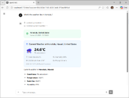
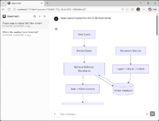
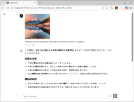
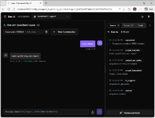
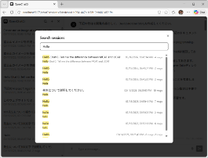
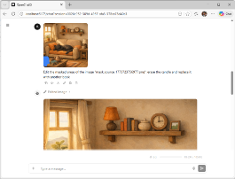

# ChatWalaʻau

**The localhost AI Agent Runtime** -- Chat UI, Tools, RAG, and MCP in one `pip install`

[](https://pypi.org/project/chatwalaau/)
[](LICENSE.md)
[](https://pypi.org/project/chatwalaau/)

ChatWalaʻau is a **full-stack AI agent runtime** that runs entirely on localhost. It connects a modern chat UI to AI agents via the AG-UI protocol, with built-in tools, a RAG pipeline, MCP integration, and an OpenAI-compatible API -- all from a single `pip install`.

> Hawaii-built, powered by [Microsoft Agent Framework](https://github.com/microsoft/agent-framework)

📖 **Full documentation & guides: [chatwalaau.com](https://www.chatwalaau.com)**

---

## Quick Start

```bash
pip install chatwalaau
chatwalaau init        # writes a .env for you to edit (and can set up your first model)
```

> **Upgrading to v0.129.0:** 52 runtime settings moved out of `.env` into the in-app
> **App Settings** screen (stored in `app_settings.jsonc`). Your server still starts, but a
> leftover value in `.env` is ignored -- the startup log names every key it finds. Run
> `chatwalaau settings migrate --write` to carry an existing configuration across. Secrets,
> ports/paths, and feature enable-gates stay in `.env`. See the
> [configuration docs](https://www.chatwalaau.com/docs/getting-started/configuration).

> **Setting up models (v0.107.0+):** chat models are configured **exclusively** through the
> Model Offering Catalog (`model_offerings.jsonc`). Run `chatwalaau init` for a guided
> first-model step, `chatwalaau models add` any time to author the file, or use the in-app
> **App Settings** screen (changes apply without a restart). The legacy per-provider model
> environment variables (`AZURE_OPENAI_MODELS`, `ANTHROPIC_MODELS`, `OPENAI_MODELS`,
> `FOUNDRY_MODELS`, `MODEL_MAX_CONTEXT_TOKENS`, `ANTHROPIC_HOSTING`, ...) have been
> **removed**. As of **v0.108.0**, image generation and RAG embeddings are configured the same
> way -- add an offering with `operations: ["image"]` or `["embeddings"]` (the former
> `IMAGE_DEPLOYMENT_NAME` / `EMBEDDING_DEPLOYMENT_NAME` / `IMAGE_*` variables are removed). See the
> [model configuration docs](https://chatwalaau.com/docs/features/models-and-reasoning).

Set your Azure endpoint / credentials in `.env` (shared with image, RAG, and speech):

```ini
AZURE_OPENAI_ENDPOINT=https://<your-resource>.openai.azure.com/
AZURE_OPENAI_API_KEY=<your-key>      # or authenticate with Entra ID instead (see below)
# ANTHROPIC_API_KEY / OPENAI_API_KEY as needed -- referenced by NAME from the catalog
```

Then author **at least one chat model** in `model_offerings.jsonc` (or run
`chatwalaau models add`). Example spanning several providers:

```jsonc
{
  "offerings": [
    { "id": "gpt-5.5", "provider": "azure-openai", "model_ref": "gpt-5.5",
      "endpoint": "${AZURE_OPENAI_ENDPOINT}", "default": true, "context_window": 1050000 },
    { "id": "claude-fable-5", "provider": "anthropic", "hosting": "direct",
      "model_ref": "claude-fable-5", "api_key_env": "ANTHROPIC_API_KEY" },
    { "id": "gpt-5.1", "provider": "openai", "model_ref": "gpt-5.1", "api_key_env": "OPENAI_API_KEY" },
    { "id": "deepseek-v4-pro", "provider": "foundry", "model_ref": "deepseek-v4-pro",
      "endpoint": "https://<resource>.services.ai.azure.com/api/projects/<project>" }
  ]
}
```

Each offering self-describes its provider, `model_ref` (the connector's real
model/deployment name), optional `endpoint` / `base_url` / `hosting` / `context_window`,
and references any API key by env-var NAME via `api_key_env` (secrets stay in `.env`). An
azure-openai offering may omit `endpoint`/`api_key_env` to reuse the shared Azure lanes above.
An offering may also declare what its **deployment** can serve via an optional
`capabilities` block (`web_search`, `native_structured_output`) -- use it when an endpoint
rejects a feature, e.g. a Claude deployment created in Microsoft Foundry with the
*Hosted on Azure* hosting option, which supports neither server-side tools nor structured
outputs ("web search not supported in your workspace"; recreating it as *Hosted on
Anthropic* is the real fix). Omit the block and nothing changes; the same settings are
editable in the App Settings screen.

Then start the server:

```bash
chatwalaau
```

Open: [http://localhost:8000/chat](http://localhost:8000/chat)

> **Azure authentication options.** An API key (`AZURE_OPENAI_API_KEY`) is the
> quickest and always takes precedence -- set it and you do **not** need `az login`.
> To use Microsoft Entra ID instead, leave the key unset and pick a credential lane
> with `AZURE_CREDENTIAL_MODE`: `cli` (default -- `az login` for local dev),
> `managed-identity` (Azure App Service / Container Apps / AKS / Functions / VM), or
> `default` (auto-discovery). Anthropic uses `ANTHROPIC_API_KEY` for `direct`
> hosting, or Entra ID for `foundry` hosting. Microsoft Foundry is Entra ID only
> (it reuses the same credential lanes; no API key exists). See the
> [Authentication guide](https://www.chatwalaau.com/docs/api-and-cli/authentication).

> Behind a corporate TLS-intercepting proxy? Install with `pip install "chatwalaau[corp]"`
> so Python trusts your OS certificate store. See the
> [Installation guide](https://www.chatwalaau.com/docs/getting-started/installation).

---

## Highlights

- **Modern chat UI** -- Markdown, code, math (KaTeX), Mermaid, reasoning blocks, web search with citations, voice in/out, image analysis, **attach a PDF and the assistant reads it directly** (given to the model as context, like an image -- natively on Azure OpenAI / OpenAI / Foundry, or as extracted text on other providers), a built-in **paint canvas** -- draw, paste, or load an image from your device **or the coding workspace**, then attach and re-edit it; a sized artboard with 16:9 / 4:3 / 1:1 presets, Hand-tool panning and 5%-800% zoom, duplicate / copy-paste with a right-click menu, and **arrows and lines that glue to your shapes and follow them when you move them**, Temporary Chat, **Privacy Screen** (one click scrambles your chat history, your own messages, and your attachments -- replacing the text, not blurring it -- so you can demonstrate a real instance on a shared screen; the agent's replies stay readable), **message-by-message navigation** (previous/next step buttons that walk the conversation one message at a time), **slash commands** (`/help`, `/prompt`, `/skill`, `/model`) with completion and dynamic arguments, and a **compact chat sidebar** that collapses by section and loads hundreds of conversations as you scroll (click the logo for a new chat; every conversation has its own URL, so any chat can be bookmarked or **opened in a new tab**, and its title can be **regenerated** once the conversation has moved on)
- **Agent tools** -- image generation + mask editor, weather, coding tools with an approval workflow (a per-turn round counter, a configurable round budget, and "approve for this session" that stops counting against the budget and clears the other pending cards of that tool), prompt templates, and Agent Skills (enable/disable or hot-reload from disk at runtime; a skill folder is a **boundary** -- a `SKILL.md` nested inside another skill belongs to that parent skill, so use sibling folders or one grouping level for separate skills, and the Skills manager lists exactly what the agent loads). **Skills and Background (BG) are mutually exclusive**: a background answer is resumed by id and cannot complete a skill's tool call, so while BG is on the skill tools are not offered — the toggle says so before you send, and function tools, MCP tools and web search are unaffected. On **Anthropic** models the skill tools ask for **approval** the first time they run in a session (rather than being auto-approved as on other providers) — the agent framework's auto-approval path produces a request Anthropic rejects, so skills take ChatWalaʻau's own approval route there instead; "approve for this session" makes it a one-time prompt. As of **v0.139.0** a skill's `scripts/` / `references/` / `assets/` folders are read **only when they are real folders under the skill** -- a **directory junction** (`mklink /J`), a symlink, or another **reparse point** (which on Windows includes some OneDrive-backed paths) is skipped, and the only trace is a `reparse point` warning in the backend log. The skill still loads; only the linked files drop out, so copy or move them under the skill folder if you need them. This is an upstream safety rule with no configuration switch. As of **v0.141.0** Skills are wired the **same way on every lane**: the enable/disable selection, the `CODING_ENABLED`-gated script runner and the recognised script types (`.py` / `.sh` / `.bash` / `.js` / `.mjs` / `.cjs`) now apply to **Harness agents** as well as chat, where a second loader had previously carried none of them -- so a skill you switch **off** is off everywhere, and saving or reloading your selection also ends any harness conversation in progress (that is the only way the change can reach a run already going). A blank `SKILLS_DIR` now means **no skills** rather than "the folder the server was started in". Still open, and stated as open: the framework offers `run_skill_script` to the model even when no skill ships any scripts, which is what makes an agent invent a script name such as `noop` and retry against a "not found" reply -- cancel the turn if you see it loop. As of **v0.143.0** approving two or more tools across separate rounds of one answer no longer fails the turn: the earlier rounds were replayed to the model as still-pending approvals, which the agent framework discards on sight (an approval decision is spent once it is used), leaving a tool call the model provider refused to accept -- so every such turn died on its third request with an internal error, on every provider. Completed rounds are now replayed as completed work. Where a finished tool's output can no longer be recovered, the call is withdrawn and the agent asks again, so you may occasionally be shown a second approval card for something that already ran
- **Models** -- switch between **Azure OpenAI**, **Anthropic (Claude)**, **OpenAI**, and **Microsoft Foundry** mid-conversation, with per-message generation options (reasoning effort and, on gpt-5.x, verbosity), **structured output** (constrain the answer to JSON / a JSON Schema), and provider-agnostic **prompt caching** that cuts input-token cost on long/coding turns (on by default, output-transparent); as of **v0.107.0** models are configured **exclusively** through the **Model Offering Catalog** (`model_offerings.jsonc`) -- **compose the served models** (multi-provider and gateway offerings) from the CLI (`chatwalaau models add`) or the in-app **App Settings** screen, **drag to set the order they appear in the selector**, and changes apply live without a restart (the legacy per-provider `*_MODELS` env vars have been removed); as of **v0.108.0** the **image generation** and **RAG embedding** models are configured the same way -- add an offering with `operations: ["image"]` (with optional `image_defaults`) or `["embeddings"]`, and the former `IMAGE_DEPLOYMENT_NAME` / `EMBEDDING_DEPLOYMENT_NAME` / `IMAGE_*` env vars are removed; as of **v0.109.0** the per-task **helper models** (chat title, user-/agent-memory, Teams meeting summary, ontology NL-to-SPARQL) are assigned in the catalog too under **Task model assignments** (a `roles` block, the App Settings screen, or `chatwalaau models role set`) -- each points at one of your chat offerings so it routes to the right provider, and the former `SESSION_TITLE_MODEL` / `USER_MEMORY_EXTRACTION_MODEL` / `AGENT_MEMORY_CURATION_MODEL` / `TEAMS_MEETING_SUMMARY_MODEL` / `ONTOLOGY_NL_MODEL` env vars are removed; as of **v0.123.0–v0.124.0** an offering can also declare what its **deployment** supports -- **hosted web search** and **native structured output** are per-offering **capabilities** in the App Settings screen, because availability follows the deployment and not the provider (the same Claude model reached through two different routes does not offer the same tools). Declaring nothing keeps today's behavior exactly; declaring a capability unavailable withholds the tool cleanly instead of letting the turn fail, and the composer hides a control the model cannot serve rather than offering one that errors. A **no-schema** structured-output request now resolves to a default schema **the provider can actually accept** -- the "any JSON object" shape is valid on OpenAI and rejected outright by Anthropic -- and when a deployment refuses a feature, the chat says which restriction it hit and what to change, instead of "an internal error occurred". As of **v0.139.0** the framework moved to **Microsoft Agent Framework 1.14.0**, whose Foundry connector began stripping encrypted reasoning content from every request unless the caller asks for it explicitly -- which would have quietly switched the **reasoning panel off on Foundry o-series / GPT-5 deployments**. The Foundry lane now **states** which deployments want that content and which reject it (DeepSeek / Grok / Llama / Phi answer `400` on it) rather than only removing what it does not want, so reasoning keeps rendering exactly as before
- **Knowledge** -- RAG over your PDFs (ChromaDB), ingested by the built-in **Pipeline Jobs** engine: submit/monitor/cancel jobs from a portal, the API, or the agent (reference an uploaded PDF by its **filename**), with live progress and run history (on by default)
- **Ontology** -- design **concept models as RDF knowledge graphs** on a visual node canvas: circular entities (emoji, colors, typed properties with **key attributes**) connect from **anywhere on the node's ring (360°)** with directional, cardinality-labeled relationships that **fan out when parallel** so each is individually selectable, and clicking a node or edge lights up its whole in/out neighborhood; **rename** ontologies in place, search with **SPARQL or natural language** with on-canvas highlighting, import/export standard RDF with automatic backups, and let the agent **answer from your ontologies in any chat** (opt-in via `ONTOLOGY_ENABLED`)
- **MCP native** -- connect any MCP server (Claude Desktop-compatible config); enable/disable servers and individual tools at runtime to control token usage, or hot-reload the config (reconnect) without a restart; MCP Apps render interactive UI in chat
- **Memory** -- a configurable Agent Identity, a self-maintaining User Preference Memory (about you), and an Agent Memory (about the work -- project conventions, tool quirks, operating rules) that the agent curates inline and you can grow by giving any chat turn a thumbs-up to "remember this turn"; a built-in **Memory editor** lets you view and edit all three files (`IDENTITY.md` / `USER.md` / `MEMORY.md`) in a Markdown editor with automatic timestamped backups
- **Scheduled execution** -- a built-in **Cron Scheduler** runs workspace scripts on a cron expression, an interval, or once after a delay; manage jobs from a portal, the API, or the agent (opt-in via `CRON_ENABLED`)
- **File Explorer** -- a built-in VSCode-style **file tree + monaco editor** to browse and hand-edit files in your coding workspace, with tabs, create/rename/delete, drag-to-move, **upload files & folders (multiple, with an overall-progress bar)**, **file/folder download (ZIP)**, **PDF & image preview with zoom** (with **Attach to chat** to hand an open image/PDF to the composer), and a **split editor** (drag tabs between panes) (opt-in via `FILE_EXPLORER_ENABLED`)
- **Microsoft Teams** -- talk to the agent from a Teams personal chat, group chat, or channel (Bot Framework JWT auth, typing indicator, Adaptive Card tool approval, Entra Object-ID allow-list; opt-in via `TEAMS_ENABLED`)
- **Declarative agents & workflows** -- define an agent (persona, model, per-agent tools, output policy) in a YAML file or a built-in GUI editor and switch the active agent at runtime; or compose a **declarative Workflow** (`kind: Workflow`) that orchestrates your Prompt agents as a graph, authored in a visual **DAG editor** with the full Microsoft Agent Framework action set -- variables, control flow (`If` / `ConditionGroup` / `Foreach` with `BreakLoop` / `ContinueLoop` / `GotoAction`, shown as nested container nodes), agent invocation, human-in-the-loop (`Question` / `RequestExternalInput`), and opt-in, jailed tool / MCP / HTTP calls (off by default; enabled per class via `WORKFLOW_FUNCTION_ACTIONS_ENABLED` / `WORKFLOW_MCP_ACTIONS_ENABLED` / `WORKFLOW_HTTP_ACTIONS_ENABLED`, with an MCP allow-list to your configured servers and an HTTP host allow-list + SSRF guard). Both kinds are managed in **one** modal (told apart by a `Prompt` / `Workflow` tag), and a workflow runs either **in chat** as a selectable run-target (live progress graph, the answering agent/workflow named on each message) or as a **background pipeline job**; the built-in CORE agent reproduces the default behavior (opt-in custom agents & workflows via `DECLARATIVE_AGENTS_DIR`, bounded by the **Workflow superstep cap** in App Settings -> Limits). Every action form writes the field names the Microsoft Agent Framework runtime actually reads, each action takes an optional **display name** that labels its step in the live progress view, and variable fields suggest the variables the workflow already has (its `Local.*` names plus whatever `inputs:` / `outputs:` declare) -- a name typed without a namespace is stored as `Local.`, and a write the runtime cannot accept is reported **before** the workflow runs instead of failing mid-run. A run that fails says why in one sentence and marks the step that failed in the progress view. In both editors **saving is a checkpoint, not an exit**: the screen stays open with your canvas, selection and scroll position intact, the button reads **Create** until the first save and **Save** after it, repeated saves update the **same** agent or workflow, and **Close** (which still guards unsaved changes) is the only way out. When the running agent is not the built-in one, its name appears above the message box -- **click it** to reopen the management modal. As of **v0.125.0**, **`BreakLoop` actually breaks the loop** -- before this it was indistinguishable from `ContinueLoop` and the loop ran to completion either way, so a workflow written against the old behavior will now exit its loop early.
- **Watch a workflow run** -- a run streams **standard AG-UI events** (`STEP_STARTED` / `STEP_FINISHED` / `ACTIVITY_SNAPSHOT`), the same vocabulary the Microsoft Agent Framework's own adapter emits, so it is readable by any AG-UI client and not just this UI. Press **Diagram** on the run indicator to open a **detached run canvas**: a movable, resizable window showing the **whole graph** -- including the branch that was *not* taken, which the run stream itself never reports -- with per-step logs, four step states (running / completed / **skipped** / failed), and one canvas per run so a failing run can be compared against the one that worked. Closing it hides it; pressing **Diagram** brings it back with its state intact. A `Question` step **pauses the turn** as an AG-UI interrupt and resumes the same run with its variables intact, so a pending question survives a page reload. A **Variables** pane shows the `Local.` / `Workflow.*` / `System.` namespaces at each superstep (secret-looking keys redacted -- a name-based heuristic, so keep real secrets out of workflow variables). Reloading a chat restores each workflow turn's steps and can re-open its diagram.
- **Harness Agents** (v0.128.0) -- a third declarative kind, **`kind: Harness`**, built on the Microsoft Agent Framework harness (`create_harness_agent()`): an autonomous software-engineering agent with a persistent **todo list**, **plan/execute modes**, **file-based session memory**, **jailed file access + shell** scoped to `CODING_WORKSPACE_DIR`, **Agent Skills**, hosted **web search** (per-model capability gate respected), context compaction, and a keep-going-until-done loop capped at 10 iterations. Composed in the same management modal (a `HARNESS` tag) with a form + canvas + live-YAML editor, and run as a **per-conversation run-target** like a workflow -- file writes and shell commands raise the existing approval card, and the YAML never carries credentials, a provider, or sampling parameters. As of **v0.133.0** two defects that ended long harness sessions with *"Your input exceeds the context window of this model"* are fixed: **context compaction now actually runs** (it never had -- the framework builds a compaction strategy only when both a window size and an output budget are given, and `compaction.maxOutputTokens` was blank by default in the editor, the sample YAML and the docs, so the feature was off while every screen reported it on; a blank value now means *use the default*, and an agent whose compaction cannot be configured refuses to build rather than run without it), and a **tool-approval session no longer inflates its own context** (after each approval the run replayed the turn back into an agent that had **already saved** it, and because the agent then re-sent those duplicated calls the next round replayed a bigger block still -- three user messages reached 200 messages and 926 request items after seven approvals). The re-run now sends only the approval decision and lets the agent read the rest from its own history; ordinary chats, whose history is not written until the turn ends, keep the replay they need. The agent's detail panel shows the **compaction budget a run would really use**, so an inert configuration can no longer look healthy. As of **v0.134.0** the chat's tool activity names the subsystem each tool actually belongs to: a harness agent's file, memory, todo, mode and shell calls -- and, in ordinary chats, `manage_cron` / `query_ontology` and four others -- had all been labelled **`MCP: <name>`** with an external-connection icon. That was a fallback branch, not a check, so 32 tools with nothing to do with MCP pointed operators at a subsystem that has no authority over the call. They now read as what they do ("Ran command", "Listed workspace files", "Managed scheduled jobs"), **`MCP:` is verified against the live MCP inventory before it is shown**, and a genuinely unknown tool reads as `Tool: <name>` rather than a confident wrong attribution. Labels are computed when a message renders, so older conversations show the corrected names on reload. As of **v0.135.0** a harness run is **no longer stopped for getting a lot done**: every file write and shell command it makes is an approval round, so the 200-round runaway limit was really counting how much the agent had accomplished -- a real run died at `total=201/200` with `interactive=0/33`, without anyone being asked to approve anything. A harness turn is now bounded by **not getting anywhere** (consecutive rounds that execute no tool and produce no output; thinking is not progress), which catches a genuinely stuck agent about 8x sooner while a long productive run simply finishes -- and a stopped run now **reports how many tools it executed** instead of naming only the number it crossed. Ordinary chats keep the limit that works for them; the fix is written against whether an agent re-invokes itself, not against "is this a harness". As of **v0.140.0** the framework moved to **Microsoft Agent Framework 1.15.0**, which carried two changes that would each have broken harness agents silently. It added its own history de-duplication keyed on the message id when there is one and on a **hash of the message content** when there is not -- and a message you type carries no id, so it would have discarded the second of two identical messages, contradicting the 0.138.0 guarantee that de-duplication is keyed on provider-assigned tool-call ids and **never** on what you wrote; ChatWalaʻau now gives every message a unique id before it reaches the store, so both layers agree and **sending the same message twice still records it twice** (two identical messages get different ids, because an id derived from the text would have re-introduced the very behaviour being removed). It also tagged every harness loop iteration with an internal marker that **no provider connector removed again** -- the marker reached the model provider as a real request parameter and was rejected on the *first* call of every harness turn, on **Azure OpenAI, OpenAI, Foundry and Anthropic alike** -- so the marker is now stripped where each lane assembles its request. As of **v0.141.0** Agent Skills reach harness agents through the **same loader chat uses**: that lane had built its own, which carried none of the fixes the chat path had accumulated -- a skill script raised *"requires a runner"* instead of running (so `CODING_ENABLED` governed nothing there), `.sh` / `.js` skill scripts were invisible, and a skill you switched **off** in the Skills modal was still advertised. One wiring now serves both, the Skills modal's selection is honoured everywhere, and a Skills save or reload also ends any harness conversation in progress so a gating change cannot survive in a cached agent. Still open, and stated as open: the framework advertises `run_skill_script` even when no skill has scripts, which is what makes an agent invent a script name such as `noop` and retry. As of **v0.142.0** the framework moved to **Microsoft Agent Framework 1.16.0**, which **fixes the loop-marker defect upstream** -- the one that broke the first model call of every harness turn on every provider in v0.140.0. ChatWalaʻau's own correction is **kept anyway**: a guard is not withdrawn in the same release that moves the framework version underneath it, because a regression then could not be attributed to either change. The more useful outcome is what that fix exposed on this side -- the test written in v0.140.0 to announce exactly this event **did not fire, and could not have**, because it asserted something about a provider connector that stayed true while the framework fixed the problem one layer higher. Such a test now has to sit where the failure was **observed** rather than where it was diagnosed, and the existing ones were audited against that rule rather than only future ones. This release also picks up a framework fix for **streaming while tracing is enabled**, and carries no operator-visible change of its own: no setting, environment variable, route, schema or authored artifact is touched.
- **Inbound webhooks** -- drive the agent from external events via a **Webhook Gateway** with a management portal; the first source is **Microsoft Graph**, which auto-summarizes **Teams meeting transcripts** into the workspace (opt-in via `WEBHOOK_ENABLED`), or summarize a meeting you organized on demand by signing in yourself (device-code, no service principal or admin policy); the portal shows **live** Graph subscriptions, offers **delete-and-re-subscribe** when a subscription already exists, and surfaces the **auto-renewal schedule**. **Transcript access needs a Teams *tenant* setting as well as Entra permissions** -- Teams admin center → Meetings → Meeting settings → **Transcript API access** → **Microsoft Graph access** (default **off**, enforced since **2026-07-29**), plus **Include speaker attribution** (also default off, and without it the summary cannot determine action-item owners or participants). Both lanes need it; app permissions do not override it. If a 403 hits that gate, ChatWalaʻau now says which setting to change instead of showing the raw Graph error
- **OpenAI-compatible API** -- expose the agent as `/v1/responses` for any OpenAI-SDK app
- **App Settings, in the app** -- as of **v0.129.0** the runtime tuning knobs no longer live in `.env`. **52 settings** -- generation, chat & session, memory, speech, RAG, limits and the cron schedule -- moved into an **App Settings** screen (the renamed Model Settings modal, now hosting the Model Offering Catalog *and* seven settings groups), backed by an operator-owned `app_settings.jsonc`. The first-run `.env` shrinks from ~150 keys to ~97, leaving only endpoints, credentials, ports, storage locations and feature gates. Every control **says when it takes effect** -- *applies immediately* (37 settings), *rebuilds agents* in place (3), or *restart required* (12) -- so a value that is saved but not yet live never looks like it took effect; ChatWalaʻau never restarts itself, it tells you which keys are waiting on you. Upgrading is one command (`chatwalaau settings migrate --write`) and the startup log **names** every relocated key still sitting in your `.env`. Secrets, bootstrap paths and every feature **enable-gate** deliberately stay in `.env` -- a screen that could widen the sandbox would hand that power to whoever reaches the screen, so `CODING_ENABLED` stays put while `CODING_BASH_TIMEOUT` moves. A settings file written by a **newer** release will not stop an older one from starting: keys it does not recognise are kept, not rejected
- **Survives a restart** -- deploying or restarting the backend no longer signs anyone out, and a message you were typing is never thrown away: if the server is unreachable your text comes back to the input box with a **Retry** button, and an expired sign-in opens a dialog **over your intact chat** instead of reloading the page. If the API server is not up yet, the app **says so** and waits for it, instead of rendering a chat page where nothing works. Sessions persist as SHA-256 digests only -- never the token itself (`AUTH_SESSION_PERSIST`, on by default)
- **Yours, local-first** -- file-based sessions, vectors, and uploads stay on your machine; unified API-key auth and an optional web sign-in for LAN/cloud; **uploaded and generated images are served behind your session** (a raw image URL no longer opens for anyone who is not signed in -- when web login is on, even on `localhost` and behind a dev/reverse proxy); an opt-in **Prompt Dump** (`PROMPT_DUMP_ENABLED`) writes the exact flowing prompt per run to a folder for debugging -- including the agent's **tool surface**, which lists every built-in function, MCP server/tool, and Skill **and the ones that are missing, with the reason** (an env setting, the agent's tool allow-list, the MCP or Skills manager, or a server that is not connected), so you can see at a glance why a tool was not offered and which screen owns the gate

See the [Features documentation](https://www.chatwalaau.com/docs/features/chat-and-ui) for the full list and configuration.

---

## UI Preview

<p align="center">



</p>
<p align="center">
<sub>Weather Tools | Mermaid Diagrams | Image Analysis</sub>
</p>
<p align="center">



</p>
<p align="center">
<sub>DevUI | Search Session | Image Generation</sub>
</p>

---

## About the Name

"Walaʻau" (wah-la-OW) is a Hawaiian word meaning "to chat, talk, or converse." We chose it because it captures what the agent does, in the language of the place where the project is built. Hawaiian (ʻōlelo Hawaiʻi) is an indigenous language now in active revitalization; we use this word with respect and gratitude.

---

## Documentation

Everything -- installation, configuration, every feature, the API, the CLI, and deployment -- lives on the documentation site:

- **Getting started:** [Installation](https://www.chatwalaau.com/docs/getting-started/installation) · [Configuration](https://www.chatwalaau.com/docs/getting-started/configuration)
- **Features:** [Chat & UI](https://www.chatwalaau.com/docs/features/chat-and-ui) · [Slash Commands](https://www.chatwalaau.com/docs/features/slash-commands) · [Agent Tools](https://www.chatwalaau.com/docs/features/agents-and-tools) · [Models & Reasoning](https://www.chatwalaau.com/docs/features/models-and-reasoning) · [Voice](https://www.chatwalaau.com/docs/features/voice-and-speech) · [Knowledge & MCP](https://www.chatwalaau.com/docs/features/knowledge-and-mcp) · [Memory & Sessions](https://www.chatwalaau.com/docs/features/memory-and-sessions) · [Declarative Agents](https://www.chatwalaau.com/docs/features/declarative-agents)
- **API & CLI:** [OpenAI-compatible API](https://www.chatwalaau.com/docs/api-and-cli/openai-compatible-api) · [Authentication](https://www.chatwalaau.com/docs/api-and-cli/authentication) · [CLI](https://www.chatwalaau.com/docs/api-and-cli/cli)
- **Deployment & Ops:** [Development setup](https://www.chatwalaau.com/docs/deployment/development) · [Networking & Ops](https://www.chatwalaau.com/docs/deployment/operations)

Documentation is available in English and 日本語, with **full-text search** (including
Japanese) built into the site.

---

## Development

```bash
# Backend
cd backend && uv sync --prerelease=allow
uv run chatwalaau init --no-model    # writes .env from the bundled template
# edit .env and set AZURE_OPENAI_ENDPOINT
uv run uvicorn app.main:app --reload --app-dir src    # http://localhost:8000

# Frontend (separate terminal)
cd frontend && pnpm install && pnpm dev    # http://localhost:5173
```

Full prerequisites, Azure credential lanes, and the production build are in the
[Development setup guide](https://www.chatwalaau.com/docs/deployment/development).

---

## Supported Platforms

Windows 10/11 · macOS (Intel / Apple Silicon) · Linux (Ubuntu, Debian, etc.)

## License

[Apache-2.0](LICENSE.md)
